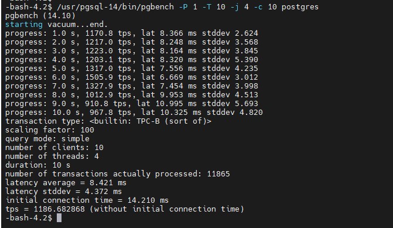
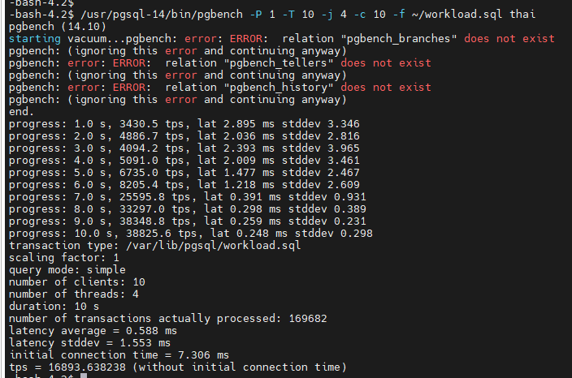
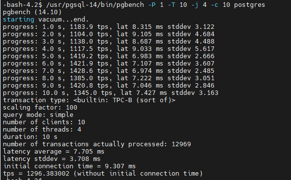
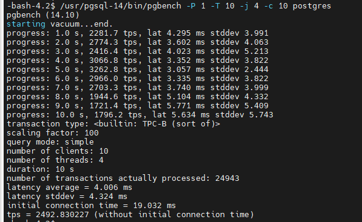
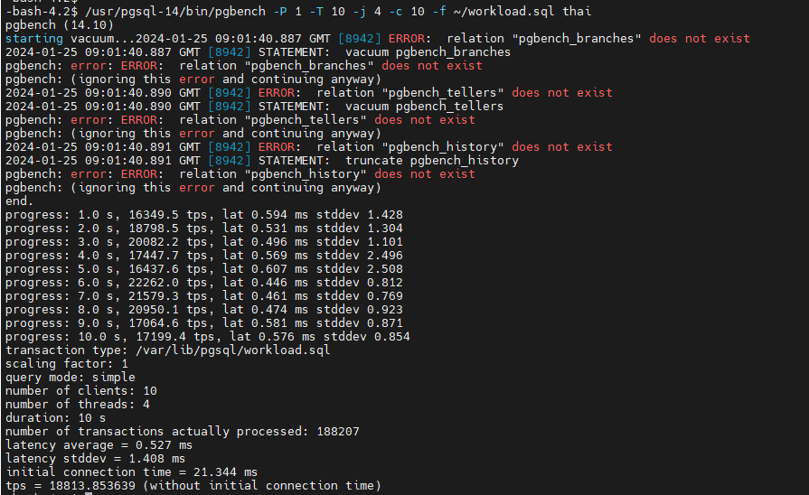

### Installation

#### Install the repository RPM:
```
sudo yum install -y https://download.postgresql.org/pub/repos/yum/reporpms/EL-7-x86_64/pgdg-redhat-repo-latest.noarch.rpm
```

#### Install PostgreSQL:
```
sudo yum install -y postgresql14-server
```
#### Checking installed PG packages:
```
rpm -qa | grep postgres
postgresql14-libs-14.10-1PGDG.rhel7.x86_64
postgresql14-14.10-1PGDG.rhel7.x86_64
postgresql14-server-14.10-1PGDG.rhel7.x86_64
```

#### Link to download rpm packages manually:
```
https://yum.postgresql.org/14/redhat/rhel-7-x86_64/repoview/postgresqldbserver14.group.html
```

#### Prepare directory to initialize PG cluster:
```
mkdir /db
chown postgres:postgres /db
```

#### Initialize PG cluster and start it:
```
/usr/pgsql-14/bin/initdb /db
/usr/pgsql-14/bin/pg_ctl -D /db start
```

---
### Restore database

#### Link to download tested database dump (created by Aristov E.) 
```
    https://github.com/aeuge/postgres16book/tree/main/database#wget-httpsstoragegoogleapiscomthaibusthai_smalltargz--tar--xf-thai_smalltargz--psql--thaisql
```

#### Restore database from the dump (need to create the database before restoring)
```
psql -c "create database thai"
psql < /dump_path/thai.sql
```
### Configuration

#### PostgreSQL Basic values to settings

```
shared_buffers
max_connections
effectiv_cache_size
work_mem
maintenance_work_mem
wal_buffers
min_wal_size / max_wal_size
checkpoint_timeout
synchronous_commit
random_page_coas
effective_io_concurrency
max_worker_processes / max_parallel_workers_per_gather
max_parallel_maintenance_workers / max_parallel_workers
```

#### How to calculate memory usage

```
Total Server RAM > 2 Gb + Shared buffers + max_connections * (work_mem + temp_buffers) + maintance_parallel_workers * maintance_work_mem
```

---
### Benchmarking

#### Creating tables for pgbench custom benchmarking:
```
/usr/pgsql-14/bin/pgbench -i -s 100 postgres
```

#### Custom pgbench benchmark loading is 80% write / 20% read:
```
https://www.postgresql.org/docs/current/pgbench.html
```

#### To simulate read loading create file workload.sql (100% read load):
```
 cat > ~/workload.sql << EOL
    \set r random(1, 5000000)
    select id, fkRide, fio, contact, fkSeat from book.tickets where id = :r;
EOL
```

#### Benchmarking with default PG configuration:
```
/usr/pgsql-14/bin/pgbench -P 1 -T 10 -j 4 -c 10 postgres
tps = 1186.682868

/usr/pgsql-14/bin/pgbench -P 1 -T 10 -j 4 -c 10 -f ~/workload.sql thai
tps = 16893.638238

```




#### Benchmarking with updated PG configuration:
```
link to PG config generator https://pgconfigurator.cybertec.at/

/usr/pgsql-14/bin/pgbench -P 1 -T 10 -j 4 -c 10 postgres
tps = 1296.383002

/usr/pgsql-14/bin/pgbench -P 1 -T 10 -j 4 -c 10 -f ~/workload.sql thai
tps = tps = 18885.302453
```




#### Benchmarking with turned off Durability property (D from ACID):
```
synchronous_commit=off
fsync=off
full_page_writes=off

/usr/pgsql-14/bin/pgbench -P 1 -T 10 -j 4 -c 10 postgres
tps = 2492.830227

/usr/pgsql-14/bin/pgbench -P 1 -T 10 -j 4 -c 10 -f ~/workload.sql thai
tps = 18813.853639
```



### Conclusion

```
turning off Durability property (D from ACID) gives a noticeable increase in recording processes &&&&&&
```

### Addtinal information:

```
there is able to change synchronous_commit value for a certain user, database and all PG cluster:

ALTER USER user_name SET synchronous_commit = off;
ALTER DATABASE database_name SET synchronous_commit = off;
ALTER SYSTEM SET synchronous_commit = off;

  
```


